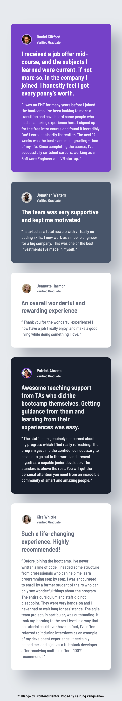
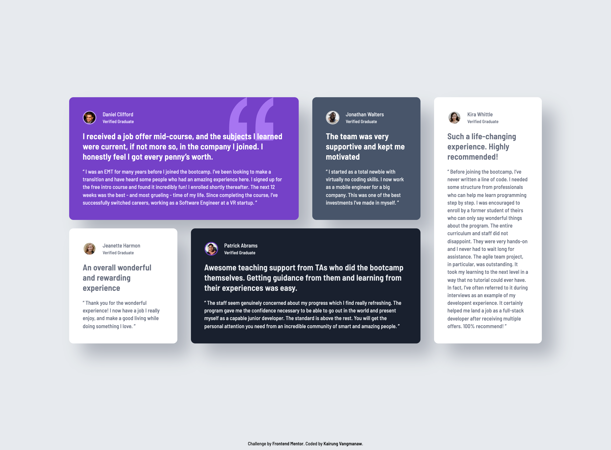

# Frontend Mentor - Testimonials grid section solution

This is a solution to the [Testimonials grid section challenge on Frontend Mentor](https://www.frontendmentor.io/challenges/testimonials-grid-section-Nnw6J7Un7). Frontend Mentor challenges help you improve your coding skills by building realistic projects. 

## Table of contents

- [Frontend Mentor - Testimonials grid section solution](#frontend-mentor---testimonials-grid-section-solution)
  - [Table of contents](#table-of-contents)
  - [Overview](#overview)
    - [The challenge](#the-challenge)
    - [Screenshot](#screenshot)
    - [Links](#links)
  - [My process](#my-process)
    - [Built with](#built-with)
    - [What I learned](#what-i-learned)
    - [Continued development](#continued-development)
    - [Useful resources](#useful-resources)
    - [AI Collaboration](#ai-collaboration)
  - [Author](#author)
  - [Acknowledgments](#acknowledgments)

## Overview

### The challenge

Users should be able to:

- View the optimal layout for the site depending on their device's screen size

### Screenshot

  
Mobile view

  

  
Desktop view

  

### Links

- Solution URL: [Add solution URL here](https://your-solution-url.com)
- Live Site URL: [Add live site URL here](https://your-live-site-url.com)

## My process

### Built with

- Semantic HTML5 markup
- CSS custom properties
- Flexbox
- CSS Grid
- Mobile-first workflow
- BEM (Block, Element, Modifier) methodology
- [React](https://reactjs.org/) - JS library
- [Vite](https://vitejs.dev/) - Frontend Tooling

### What I learned

In this project, my biggest takeaway wasn't just learning how to use CSS Grid properties, but rather how to manage grid layouts and styling through reusable classes. 

By applying the BEM methodology, I learned how to separate the structural layout from the visual design. Instead of hardcoding grid areas or colors directly, I created modifier classes (e.g., `.testimonial-card--hero`, `.testimonial-card--purple`). This approach made my React components much cleaner and the CSS highly reusable and easy to maintain.

### Continued development

In future projects, I want to keep practicing my CSS Grid and Flexbox skills to get even faster and more confident at building responsive layouts. I also plan to continue improving how I organize my CSS files and React components to keep everything simple and scalable.

### Useful resources

- [MDN Web Docs: `<blockquote>`](https://developer.mozilla.org/en-US/docs/Web/HTML/Reference/Elements/blockquote) - This helped me understand the semantic usage of the blockquote tag. I also learned a great trick to use CSS pseudo-elements (`::before` and `::after`) to insert quotation marks directly via CSS, rather than hardcoding them into the `
` tags.

- [Compart: Unicode U+00A0](https://www.compart.com/en/unicode/U+00A0) - A very handy resource that helped me find the exact Unicode character for a non-breaking space to use in my CSS `content` property.

- [MDN Web Docs: background-position](https://developer.mozilla.org/en-US/docs/Web/CSS/Reference/Properties/background-position) - This documentation clarified the different syntaxes and ways to accurately position background images.

- [Clamp Calculator](https://clampcalculator.com/) - An excellent tool that saved me a lot of time calculating the exact `clamp()` values for responsive fluid padding.

### AI Collaboration

For this project, I exclusively collaborated with **Gemini** and **Google Search AI Mode**. I used them primarily as a code reviewer and a sparring partner to check my CSS architecture, debug layout issues (like handling grid overflows), and ensure my HTML semantics met standard accessibility guidelines.

## Author

- GitHub: [Kairung Vangmanaw](https://github.com/VangmanawKairung)
- Frontend Mentor - [@VangmanawKairung](https://www.frontendmentor.io/profile/VangmanawKairung)

## Acknowledgments

A big thanks to Frontend Mentor for providing this great challenge. 

For my workflow on this specific project, I didn't use Figma or ChatGPT. Instead, I relied heavily on the built-in **macOS Preview** app to measure exact pixel values directly from the provided design images. Even though I used a design overlay in the browser for final checks, being able to quickly measure and know the exact pixel dimensions beforehand made my development process significantly faster, saving me from a lot of trial and error.
